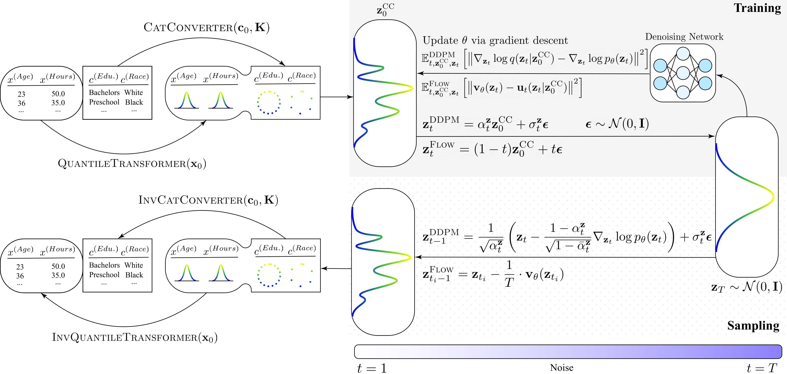
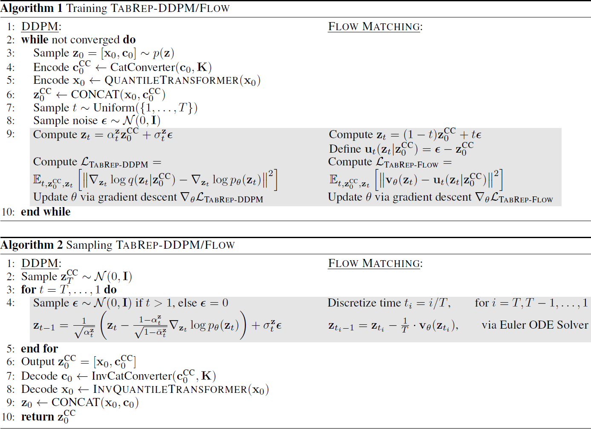

# TabRep: Training Tabular Diffusion Models with a Simple and Effective Continuous Representation
> by [Jacob Si](https://jacobyhsi.github.io/), [Zijing Ou](https://j-zin.github.io/)\*, [Mike Qu](https://mikequ1.github.io/)\*, [Zhengrui Xiang](https://tecai.github.io/about/)\*, and [Yingzhen Li](http://yingzhenli.net/home/en/).

<div align="center">
  
  <p><em>Figure 1: TabRep Architecture.</em>
</div>

<div align="center">
  
  <p><em>Figure 2: TabRep Training and Sampling Algorithms.</em>
</div>

## Installation

Our implementation is built upon [TabSYN's](https://github.com/amazon-science/tabsyn) repository. The following delineates the installation instructions.

Clone this repository and navigate to it in your terminal.

Create an environment using a preferred package manager. We provide installation instructions for Conda and UV. We recommend using [UV](https://docs.astral.sh/uv/getting-started/installation/) to for faster installation. This environment can be used for everything apart from ```eval_quality```:

Conda Installation:
```
conda create -n tabrep python=3.10
conda activate tabrep
conda install pytorch==2.0.1 torchvision==0.15.2 torchaudio==2.0.2 pytorch-cuda=11.7 -c pytorch -c nvidia
pip install -r requirements.txt
pip install dgl -f https://data.dgl.ai/wheels/cu117/repo.html
pip install torch_geometric
pip install pyg_lib torch_scatter torch_sparse torch_cluster torch_spline_conv -f https://data.pyg.org/whl/torch-2.0.1+cu117.html
```

UV Installation:
```
uv venv tabrep --python 3.10 --seed
source tabrep/bin/activate
uv pip install torch==2.0.1+cu117 torchvision==0.15.2+cu117 torchaudio==2.0.2+cu117 --extra-index-url https://download.pytorch.org/whl/cu117
uv pip install -r requirements.txt
uv pip install dgl -f https://data.dgl.ai/wheels/cu117/repo.html
uv pip install torch_geometric
uv pip install pyg_lib torch_scatter torch_sparse torch_cluster torch_spline_conv -f https://data.pyg.org/whl/torch-2.0.1+cu117.html
```

Any other missing dependencies can be installed using pip. Once all the dependencies are installed, the scripts should run accordingly.

For ```eval_quality```, create the following environment:

Conda Installation:
```
conda create -n tabrep_quality python=3.10
conda activate tabrep_quality
python -m pip install "pip<24.1"
pip install synthcity
pip install icecream
pip install category_encoders
pip install tomli
pip install tomli_w
pip install zero
pip install scipy
pip install click==8.1.7
pip install scipy==1.12.0
pip install --upgrade pip
```

UV Installation:
```
uv venv tabrep_quality --python 3.10 --seed
source tabrep_quality/bin/activate
uv pip install "pip<24.1"
uv pip install synthcity
uv pip install icecream
uv pip install category_encoders
uv pip install tomli
uv pip install tomli_w
uv pip install zero
uv pip install scipy==1.12.0
uv pip install click==8.1.7
uv pip install --upgrade pip
```

## Datasets

Download baseline datasets and run them within the ```tabrep_main``` directory as follows:
```
python download_dataset.py
python process_dataset.py
```
Classification:
- **Adult**: https://archive.ics.uci.edu/dataset/2/adult
- **Default** of Credit Card Clients: https://archive.ics.uci.edu/dataset/350/default+of+credit+card+clients
- **Stroke** Prediction: https://www.kaggle.com/datasets/fedesoriano/stroke-prediction-dataset
- **Shoppers** Purchasing Intention: https://archive.ics.uci.edu/dataset/468/online+shoppers+purchasing+intention+dataset

Multiclass-Classification:
- **Diabetes** Readmissions: https://archive.ics.uci.edu/dataset/296/diabetes+130-us+hospitals+for+years+1999-2008

Regression:
- **Beijing** PM2.5: https://archive.ics.uci.edu/dataset/381/beijing+pm2+5+data
- **News** Popularity: https://archive.ics.uci.edu/dataset/332/online+news+popularity

As Kaggle requires user log-on, the **Stroke** dataset should be downloaded manually.

To process Kaggle datasets:
```
cd data
mkdir [dataname]
# Move the downloaded Kaggle dataset .csv file into the newly-created folder
cd ..
python process_dataset.py [dataname]
```

## Training, Sampling and Evaluation

Training:
```
python main.py --dataname [NAME_OF_DATASET] --method [NAME_OF_BASELINE_METHODS] --mode train
```
```
python main.py --dataname adult --method tabrep_ddpm --mode train
python main.py --dataname adult --method tabrep_flow --mode train
```

Sampling:
```
python main.py --dataname [NAME_OF_DATASET] --method [NAME_OF_BASELINE_METHODS] --mode sample
```
```
python main.py --dataname adult --method tabrep_ddpm --mode sample
python main.py --dataname adult --method tabrep_flow --mode sample
```

Evaluation:

We include Machine Learning Efficiency (AUC, RMSE, F1 Scores), Density Estimation (Pair-Wise Column Correlation/Column Density Estimation), Quality ($\alpha$-precision, $\beta$-recall), Detection (Classifier Two Sample Test), and Privacy Preservation (Membership Inference Attacks) benchmarks to evaluate the models.

For ```eval_privacy.py```, an extra step is required to setup the package. Within the ```syntheval``` pip installation in the original ```tabrep``` environment (i.e. ```python3.10/site-packages/syntheval/presets```), create a new ```mia.json``` file and write the following:

```
{
    "mia"  : {"num_eval_iter": 5}
}
```

Then evaluate as follows:

```
python eval/eval_mle.py --dataname [NAME_OF_DATASET] --model [NAME_OF_BASELINE_METHODS] --path [PATH_TO_SYNTHETIC_DATA]
python eval/eval_density.py --dataname [NAME_OF_DATASET] --model [METHOD_NAME] --path [PATH_TO_SYNTHETIC_DATA]
python eval/eval_quality.py --dataname [NAME_OF_DATASET] --model [METHOD_NAME] --path [PATH_TO_SYNTHETIC_DATA]
python eval/eval_detection.py --dataname [NAME_OF_DATASET] --model [METHOD_NAME] --path [PATH_TO_SYNTHETIC_DATA]
python eval/eval_privacy.py --dataname [NAME_OF_DATASET] --model [METHOD_NAME] --path [PATH_TO_SYNTHETIC_DATA]
```
```
python eval/eval_mle.py --dataname beijing --model tabrep_ddpm --path synthetic/beijing/tabrep_ddpm.csv
python eval/eval_mle.py --dataname beijing --model tabrep_flow --path synthetic/beijing/tabrep_flow.csv
```

## Citation

Please consider citing our paper if you find it helpful. Thank you :grinning:!

```
@article{si2025tabrep,
  title={TabRep: Training Tabular Diffusion Models with a Simple and Effective Continuous Representation},
  author={Si, Jacob and Ou, Zijing and Qu, Mike and Xiang, Zhengrui and Li, Yingzhen},
  journal={arXiv preprint arXiv:2504.04798},
  year={2025}
}
```
